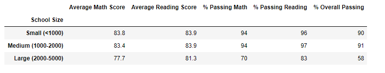

# School District Analysis

## Project Overview
The purpose of this assignment was to reevaluate the analysis without 9th grade grades at Thomas Highschool. Originally we performed the analysis on all students but due to THomas 9th grade data being altered, we re ran the data to exclude 9th grade Thomas. Then we analyzed the new results for district and school summary and compared it to the previous results.
 

## Results

* How is the district summary affected?

    The district summary total students were not effected as the code did not ask us to report the new Thomas student count numbers into the district summary. No difference were noted in average reading or math scores. The total students would have been 38,709 instead of 39170, as 461 student scores were replaced w/NaN. The math % passing score changed from 75.0% to 74.8%. Reading % passing score changed from 85.8% to 85.7%. Lastly the overall passing score changed from 65.2% to 64.9% when removing grades from Thomas High School 9th grade.
    

    
* How is the school summary affected?

   * The school summary was slightly effected with new scores from Thomas High School.
   * The percent for Thomas High SChool passing math was 93.3% where as without 9th grades it is now 93.2%. For reading, it was previously 97.3% and now it is 97%. Overall percentage changed from 90.9% to 90.6%.
     
    
* How does replacing the ninth graders’ math and reading scores affect Thomas High School’s performance relative to the other schools?

    * Thomas High School stayed in position 2 of the top schools in the district. 
    * Overall percentage of passing went from 90.5% to 90.6% without the ninth grade scores. 
    
    
* How does replacing the ninth-grade scores affect the following:
   Math and reading scores by grade:
     * Replacing ninth grade scores with NaN effected the results marginally. 
     * Thomas Highschool math scores increased from 83.6% to 83.4%. 
     * Thomas High School reading scores increased from 83.7% to 83.8%.
          
 * Scores by school spending
 
     * Thomas High School is in the $630 -$644 bin budget per student. 
     * There was no difference noticed in average math or reading grades. 
     * The % passing math was 73.4%, % passing reading was 84.4%, and overall passing was 62.9%. Without Thomas High School ninth graders, the % passing math is 73.5%, % passing reading is 84.3% and overall passing is 62.8%. 
          
          
 * Scores by school size
 
      * Thomas High School is in the middle size bin. The middle size bin had a spend of $62.8 and is now $62.9 without the 9th graders at Thomas High School. All numbers stayed the same except the overall passing % increased from 62.6% to 62.8%.
 
          
          
 * Scores by school type
 
    * Thomas High School is classified as a charter school. Charter schools have a drastic success over district schools with a 90% passing rate compared to a 54% passing        rate with district schools. Replacing the 9th grade scores had no effects on the results. 
          

## Summary
The four major changes to the school district challenge when deleting 9th grade scores from Thomas High School.

     * The total students at Thomas High School decreased from 39,170 to 38,709.
     * The overall passing score for the district decreased from 65.2% to 64.9%.
     * Overall passing score for Thomas High School decreased from 90.9% to 90.6%.
     * Thomas High School math and reading scores both increased without the 9th grade data.
     
